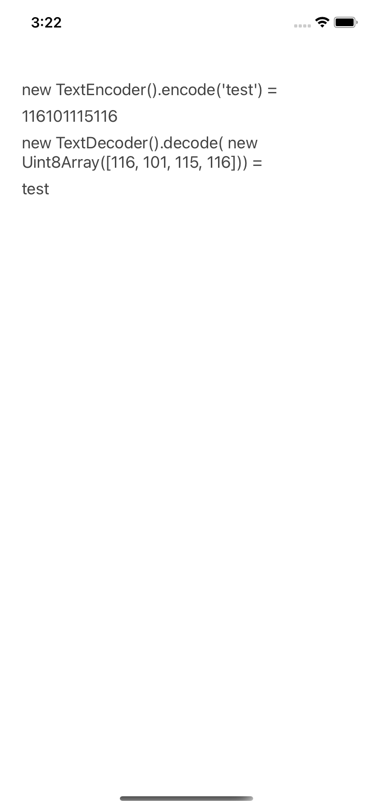

# Using web-encoding in React Native environments

## Run the app

1. install dependencies

```console
cd RNProject
yarn install
```

2. Run the app on simulators or real devices

* On iOS, `yarn ios`
* On Android, `yarn android`

3. See the result on the screen

We display two return values on the mobile screen from `TextEncoder` and `TextDecoder`.
[Here](https://github.com/somay/react-native-web-encoding-compatibility-test/blob/main/RNProject/App.js#L29-L32) is where we use these APIs.

